# VISTA: Visibility & Information System for Tracking Approvals

A web application for tracking document approvals and visibility across organizations.

---

## Team Members (Full Names)

1. John Dave Rojo  
2. Justine Jude Bardinas  
3. Kharl Jey Dagoc  
4. Isabella Gonzalez  

---

## Tech Stack Used

- **Backend:** Laravel (PHP)  
- **Frontend:** React (with TypeScript, Vite, Tailwind CSS)  

---

## Setup & Run Instructions

### Prerequisites

- **PHP** 8.2+ (with extensions: mbstring, xml, ctype, json, bcmath, **pdo_mysql**)  
- **Composer**  
- **Node.js** 18+ and **npm**  
- **MySQL** (or MariaDB) for the backend database  

### Backend (Laravel)

1. Open a terminal and go to the backend folder:
   ```bash
   cd hack-backend
   ```

2. Install PHP dependencies:
   ```bash
   composer install
   ```

3. Copy the environment file and generate an application key:
   ```bash
   copy .env.example .env
   php artisan key:generate
   ```

4. Configure the database: the app uses **MySQL** by default. In `.env` set:
   ```
   DB_CONNECTION=mysql
   DB_HOST=127.0.0.1
   DB_PORT=3306
   DB_DATABASE=vista
   DB_USERNAME=root
   DB_PASSWORD=your_password
   ```
   Create the database in MySQL (e.g. `CREATE DATABASE vista;`).

5. Run migrations:
   ```bash
   php artisan migrate
   ```

6. (Optional) Seed default users so you can log in:
   ```bash
   php artisan db:seed
   ```
   This creates:
   - **Admin:** `admin@example.com` / `password` → redirects to admin dashboard.
   - **Student org:** `org@example.com` / `password` → redirects to user dashboard.

7. Start the Laravel server:
   ```bash
   php artisan serve
   ```
   The API will be available at **http://localhost:8000**.

### How to log in

1. Open the frontend (e.g. **http://localhost:5173**). You’ll see the **Admin Login** page.
2. After running `php artisan db:seed`, you can use:
   - **Admin (OSA):** email `admin@example.com`, password `password` → you’ll be sent to the admin dashboard.
   - **Student organization:** email `org@example.com`, password `password` → you’ll be sent to the user (org) dashboard.
3. If you haven’t seeded, create users in the database (e.g. via **Tinker**: `php artisan tinker` then `User::create([...])`) or add a registration flow. Only an existing admin can create more users via the app (register endpoint).

### Frontend (React)

1. Open a **new** terminal and go to the frontend folder:
   ```bash
   cd hack-frontend
   ```

2. Install dependencies:
   ```bash
   npm install
   ```

3. (Optional) If your backend is not on `http://localhost:8000`, create a `.env` file in `hack-frontend` and set:
   ```
   VITE_API_BASE_URL=http://localhost:8000/api
   ```

4. Start the development server:
   ```bash
   npm run dev
   ```

5. Open the URL shown in the terminal (e.g. **http://localhost:5173**) in your browser.

### Summary

- Keep **Laravel** running in one terminal (`php artisan serve` in `hack-backend`).  
- Keep **React** running in another (`npm run dev` in `hack-frontend`).  
- Use the frontend URL (e.g. http://localhost:5173) to use the app.  

---

## Screenshots / Demo Link

### Admin

| Admin Login | Dashboard | Activity |
|-------------|-----------|----------|
| 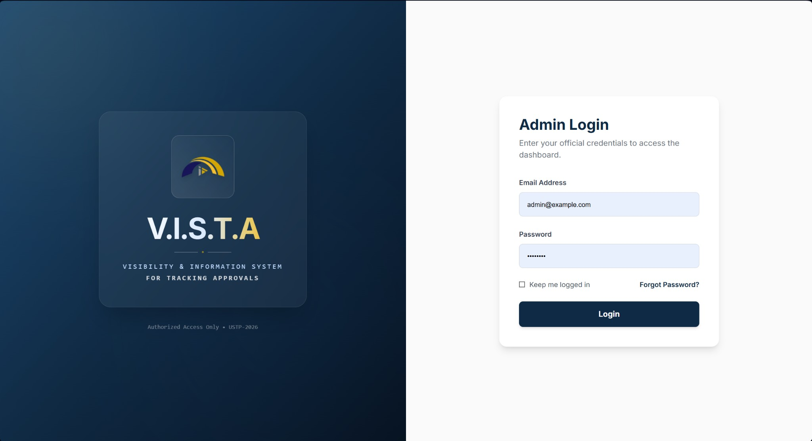 | 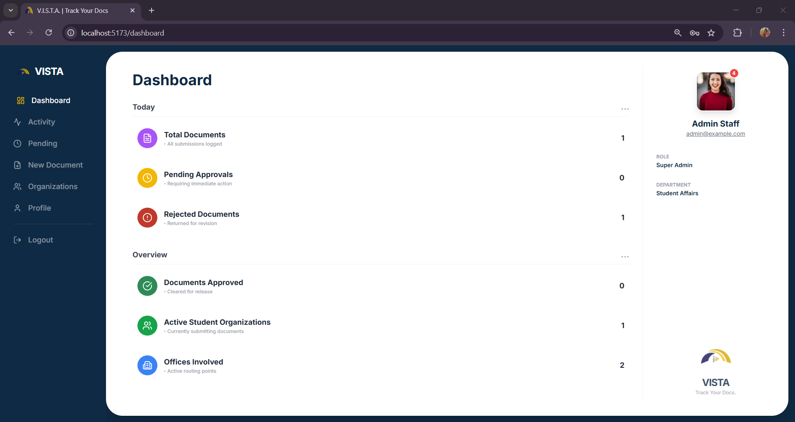 | 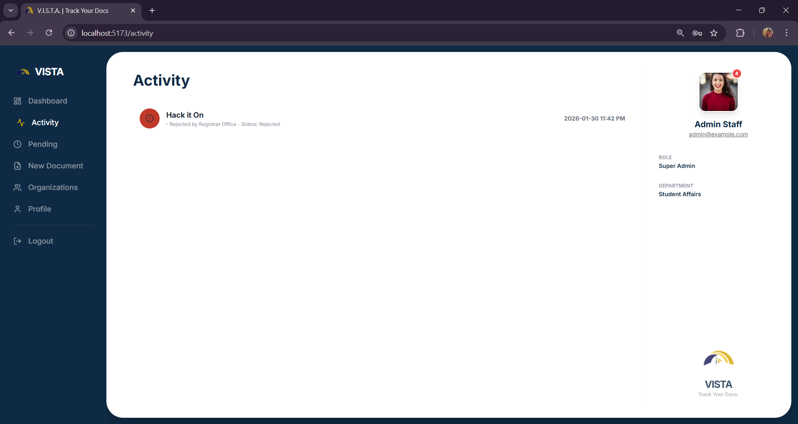 |

| Pending Actions | New Document | Organizations |
|-----------------|--------------|---------------|
| 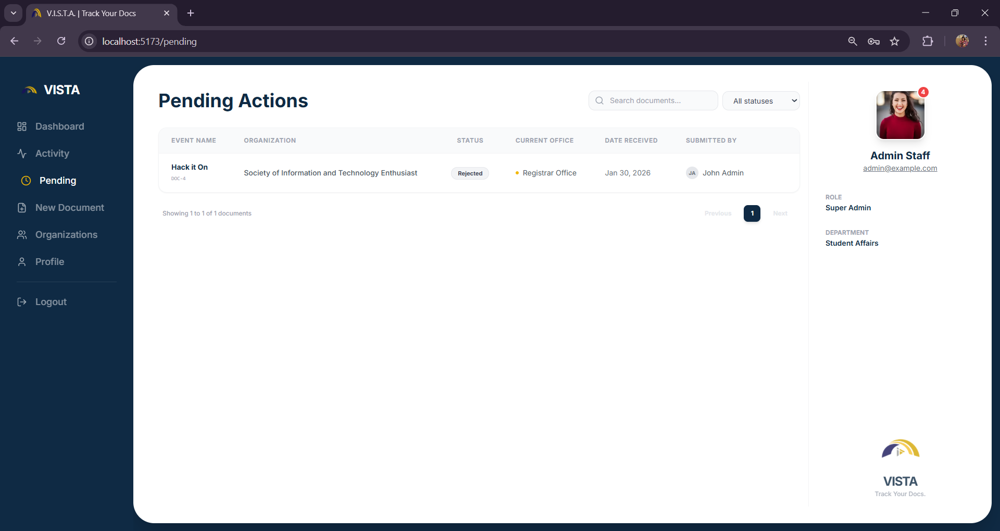 | 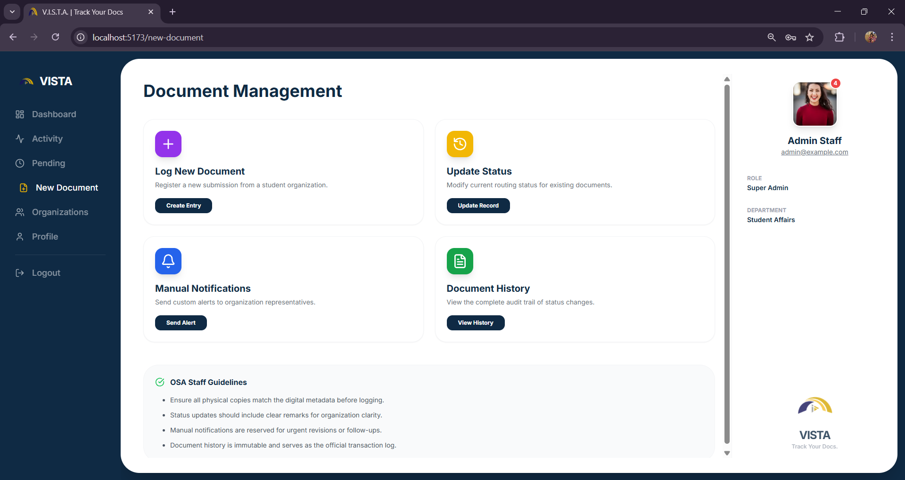 | 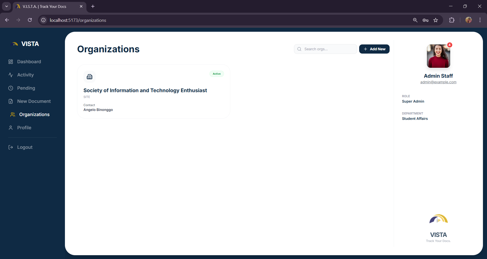 |

| Edit Profile |
|--------------|
| 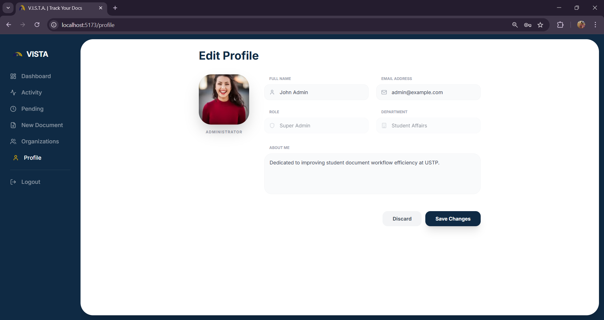 |

### User (Organization)

| My Dashboard | My Documents | Track Status |
|--------------|--------------|--------------|
| 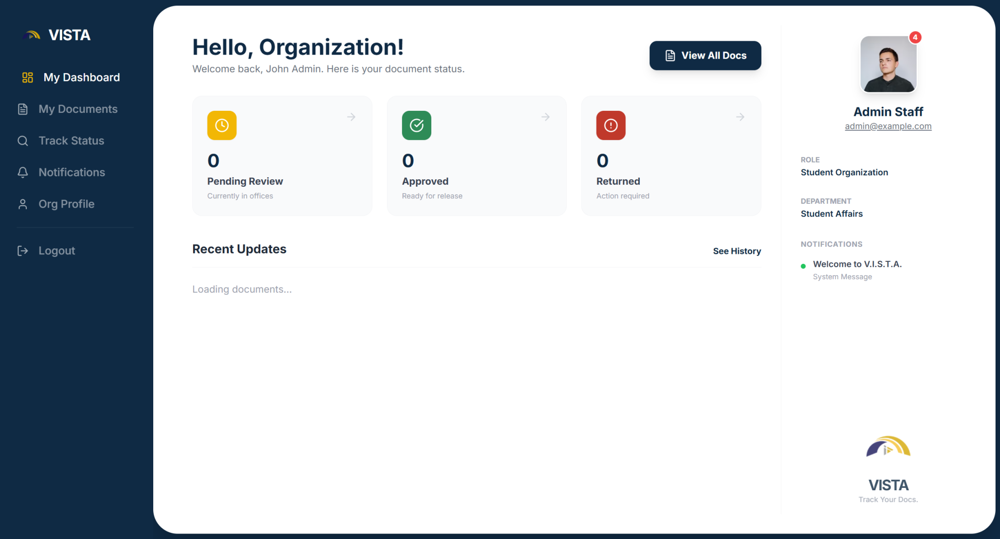 | 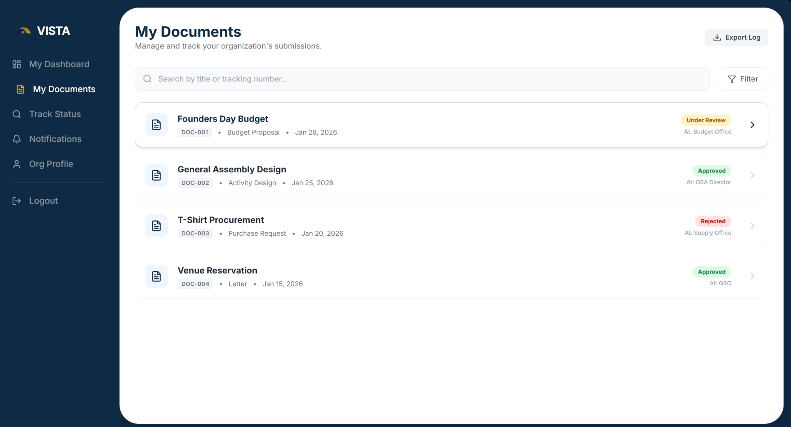 | 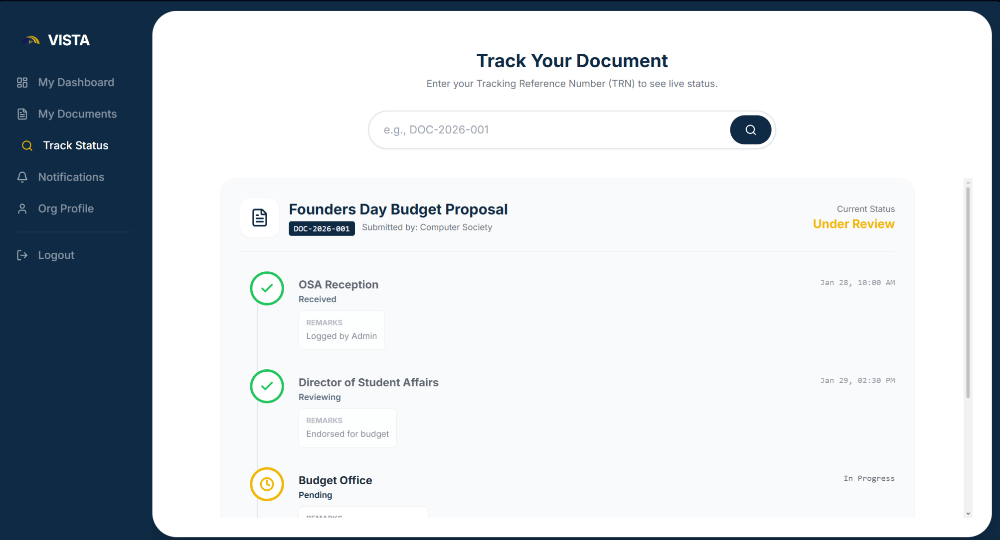 |

| Notifications |
|---------------|
| 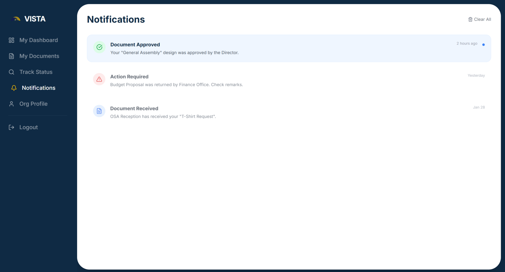 |

---

## Project Structure

- **`hack-backend/`** — Laravel API (auth, documents, organizations, offices, etc.)  
- **`hack-frontend/`** — React SPA (admin and user dashboards, documents, tracking)  
